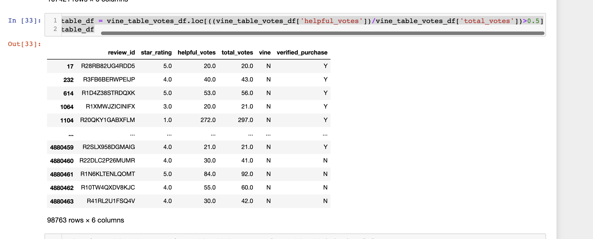
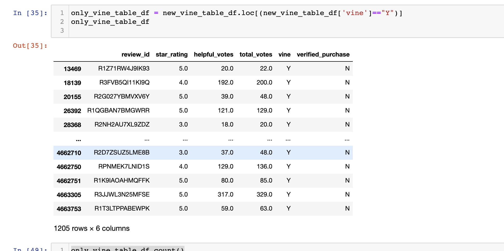
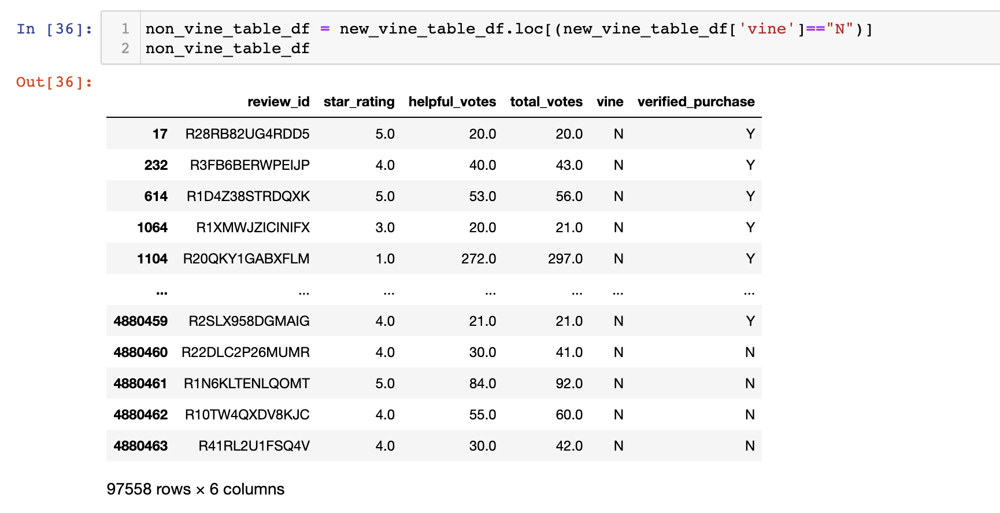
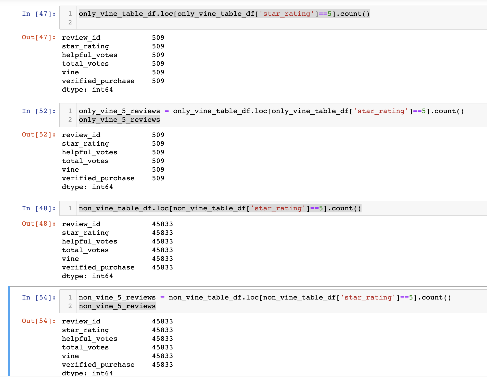
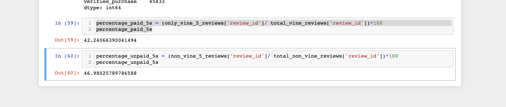

# Amazon Vine Review Analysis

## Overview of the analysis
In this project we analyzed Amazon reviews written by members of the paid Amazon Vine program. The Amazon Vine program is a service that allows manufacturers and publishers to receive reviews for their products. Companies pay a small fee to Amazon and provide products to Amazon Vine members, who are then required to publish a review. In this analysis we used Amazon Web Services (AWS) to access and perform ETL (Extract, Transform, Load) and create usable subests of the original data on Kitchen applicances purchased through the Vine program. We then used one of these smaller, cleaned datasets to determine whether the reviews from the Vine participants had a relatively higher percentage of 5 star reviews than the those from non-Vine participants who purchased the items. 

## Results 
After the ETL process was completed with PySpark on AWS, I used Pandas to read in the Vine_Table dataset csv. 

### How many Vine reviews and non-Vine reviews were there?
There were a total of 98,763 items in the data set that was analyzed from the Amazon data on kitchen items. 

Of these reviews, 1,205 were from the Vine Program:

And 97,558 were non-Vine Program reviews: 

### How many Vine reviews were 5 stars? How many non-Vine reviews were 5 stars?

- There were a total of 509 Vine reviews with 5 stars 

- There was a total of 45,833 Non-Vine reviews with 5 stars.
 

### What percentage of Vine reviews were 5 stars? What percentage of non-Vine reviews were 5 stars?
- 42.25% of the Vine Reviews had 5 stars 
- 46.98% of the Non-Vine Review were 5 stars.

## Summary
The Non-Vine reviews was made up of 46.98% 5 star reviews. The Vine reviews actually had a relatively lower percentage of positive 5 star reviews at 42.25% of the total reviews. We would need to perform further statistical analysis (possibly using a t-test) to see if this difference is significantly less or not. Based on the results of this analysis, I do not believe that there is a positivity bias for the reviews from the Vine Program, in fact it may be working against the companies and producing less 5 star reviews that with paid purchases.

